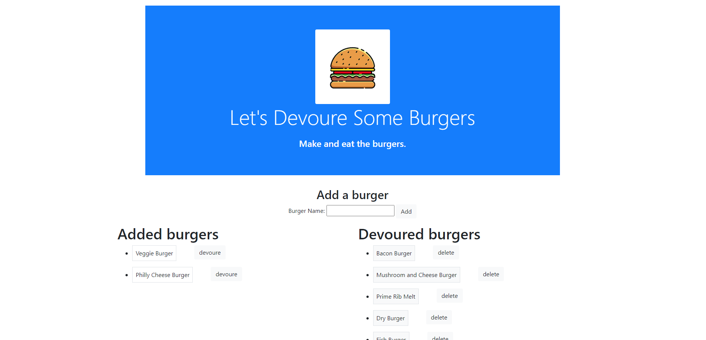
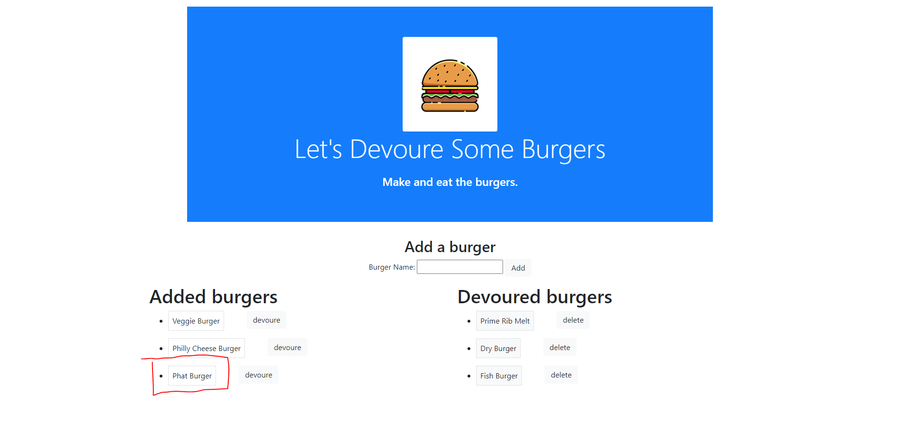

# Unit 13 - Eat the Burger

## Table of Contents

* [Description](#description)
* [Installation](#installation)
* [Usage](#usage)
* [License](#license)
* [Questions](#questions)

## Description 

This assignment was to have an app that uses the MVC structure along with Handlebars. CRUD was also expected using route POST/GET/Update/DELETE. 

## Installation

This application is deployed on HEROKU. Please Follow the path to the hosted project.

HEROKU Project Page: https://shielded-peak-78625.herokuapp.com

## Usage 

This application is simple, clean, easy to use and undertand. This app is uploaded to Heroku. Follow the Heroku link to the project and the app will be envoked on a webpage.You will be able to add new Burgers to the list. Then also move them to be DEVOURED list on the right. I've added a DELETE button incase you didn't like the burger and wanted to remove it.

## License/Technologies used

* NPM packages
* Express
* Express-Handlebars
* MySQL

## Questions

* GitHub Repo https://github.com/robertsantos-dfw

You can reach me by emailing me at robertsantos.dfw@gmail.com with any additional questions.

## Screenshots

* Getting Started

* Adding Phat Burger

---
© 2019 Trilogy Education Services, a 2U, Inc. brand. All Rights Reserved.
